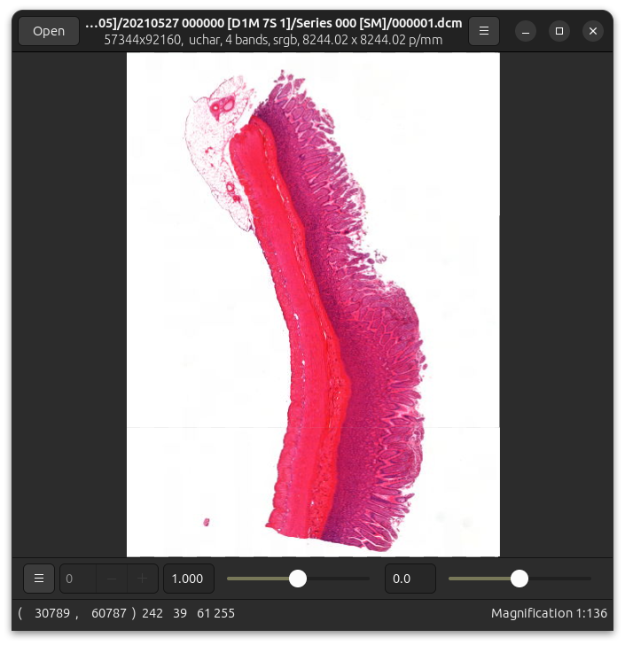

[](https://github.com/ImagingDataCommons/libdicom/actions)
[](https://libdicom.readthedocs.io/en/latest/?badge=latest)
[](https://conan.io/center/recipes/libdicom)

# libdicom

libdicom is a C library and a set of command-line tools
for reading DICOM WSI files. It is free (MIT licensed), fast,
cross-platform, uses little memory, has no dependencies, [includes API
documentation](https://libdicom.readthedocs.io), and is [easy to use from
languages like Python](https://github.com/jcupitt/pylibdicom).



libdicom returns compressed frame data, not RGB pixel arrays. OpenSlide 4.0
uses libdicom to implement DICOM support and is a better choice if you want
to process image files.

libdicom aims to support most popular DICOM WSI variants. If you have a
sample file which does not work well, please [open an issue and we'll try
to add support](https://github.com/ImagingDataCommons/libdicom/issues).

## Building from source

```shell
cd libdicom-1.1.0
meson setup builddir --buildtype release
meson compile -C builddir
meson install -C builddir
```
See [the installation
documentation](https://libdicom.readthedocs.io/en/latest/installation.html)
for build dependencies and installation options.

## Sample code

See [the documentation](https://libdicom.readthedocs.io) for full details.

```c
#include <stdlib.h>
#include <dicom/dicom.h>

int main() {
    const char *file_path = "/path/to/file.dcm";
    DcmError *error = NULL;

    DcmFilehandle *filehandle = dcm_filehandle_create_from_file(&error, file_path);
    if (filehandle == NULL) {
        dcm_error_log(error);
        dcm_error_clear(&error);
        return 1;
    }

    const DcmDataSet *metadata =
        dcm_filehandle_get_metadata_subset(&error, filehandle);
    if (metadata == NULL) {
        dcm_error_log(error);
        dcm_error_clear(&error);
        dcm_filehandle_destroy(filehandle);
        return 1;
    }

    const char *num_frames;
    uint32_t tag = dcm_dict_tag_from_keyword("NumberOfFrames");
    DcmElement *element = dcm_dataset_get(&error, metadata, tag);
    if (element == NULL ||
        !dcm_element_get_value_string(&error, element, 0, &num_frames)) {
        dcm_error_log(error);
        dcm_error_clear(&error);
        dcm_filehandle_destroy(filehandle);
        return 1;
    }

    printf("NumerOfFrames == %s\n", num_frames);

    dcm_filehandle_destroy(filehandle);

    return 0;
}
```

Or in Python:

```python
import sys
import pylibdicom

file = pylibdicom.Filehandle.create_from_file(sys.argv[1])
metadata = file.get_metadata_subset()
num_frames_tag = pylibdicom.Tag.create_from_keyword("NumberOfFrames")
num_frames = int(metadata.get(num_frames_tag).get_value()[0])
for frame_number in range(1, num_frames + 1):
    frame = file.read_frame(frame_number)
    value = frame.get_value()
    print(f"frame {frame_number} -> {frame} {len(value)} bytes")

# you can also read frames by (x, y) tile position ... this works for
# TILED_FULL and for sparse images
frame = file.read_frame_position(2, 7)
value = frame.get_value()
print(f"frame {2, 7} -> {frame} {len(value)} bytes")
```

This will print:

```python
$ ./read-frames.py sm_image.dcm
opening libdicom ...
init for libdicom ...
libdicom version: 1.1.0
frame 1 -> <10x10 pixels, 8 bits, 3 bands, RGB> 300 bytes
frame 2 -> <10x10 pixels, 8 bits, 3 bands, RGB> 300 bytes
frame 3 -> <10x10 pixels, 8 bits, 3 bands, RGB> 300 bytes
...
```

## Command-line tools

libdicom comes with two small command-line tools which can be useful for
testing.

`dcm-dump` will print all metadata from a DICOM file. It's fast, and can
dump DICOM files of any size while using only a small amount of memory.

For example:

```!
$ dcm-dump sm_image.dcm
===File Meta Information===
(0002,0001) FileMetaInformationVersion | OB | 2 | 1 | 00 01
(0002,0002) MediaStorageSOPClassUID | UI | 30 | 1 | 1.2.840.10008.5.1.4.1.1.77.1.6
(0002,0003) MediaStorageSOPInstanceUID | UI | 64 | 1 | 1.2.826.0.1.3680043.9.7433.3.12857516184849951143044513877282227
(0002,0010) TransferSyntaxUID | UI | 20 | 1 | 1.2.840.10008.1.2.1
(0002,0012) ImplementationClassUID | UI | 28 | 1 | 1.2.826.0.1.3680043.9.7433.1
(0002,0013) ImplementationVersionName | SH | 14 | 1 | wsiget v0.0.1
...
```

`dcm-getframe` will read a single frame from a DICOM file.

For example:

```shell
dcm-getframe -o tile.raw data/test_files/sm_image.dcm 12
```

To read frame 12.

## Thanks

Development of this library was supported by [NCI Imaging Data
Commons](https://imaging.datacommons.cancer.gov/), and has been funded in
whole or in part with Federal funds from the National Cancer Institute,
National Institutes of Health, under Task Order No. HHSN26110071 under
Contract No. HHSN261201500003l.

